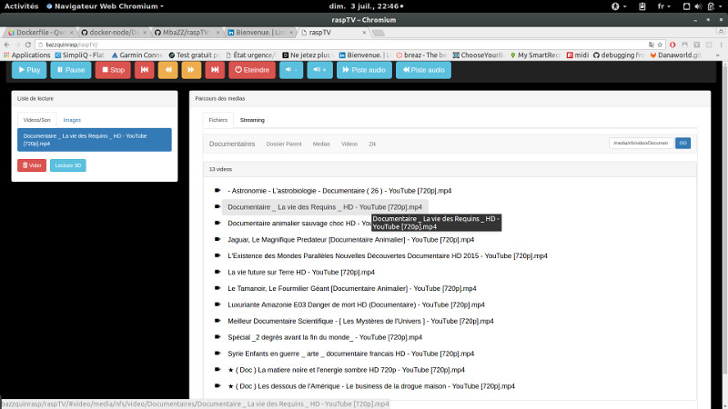

# RaspControl 
Application web de contrôle du lecteur omxplayer utilisant le module "omx-manager" 

## Lancement

    npm start

## installation
1. Pré-requis
Disposer d'un serveur web php et apache2 avec rewrite activé. 

1. Récupération des sources

        git clone --recursive https://github.com/MbaZZ/raspTV.git

2. installaiton des modules

        npm install

3. Deployement sur le serveur web

        make deployWeb 

